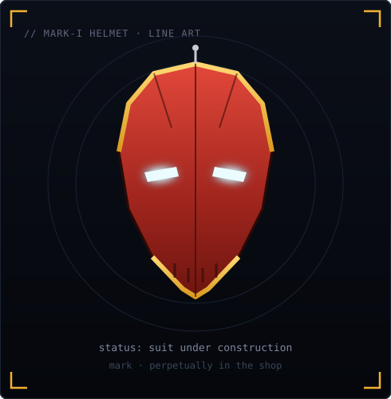
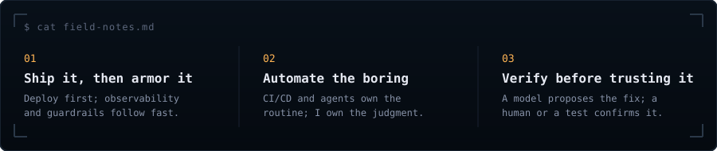

<!-- ═══════════════════════════════════════════════════════════ -->
<!-- HEADER: Self-hosted arc-reactor banner + typing SVG hook    -->
<!-- ═══════════════════════════════════════════════════════════ -->

  

 

<!-- ═══════════════════════════════════════════════════════════ -->
<!-- ABOUT: Mark-I helmet + J.A.R.V.I.S. status panel             -->
<!-- ═══════════════════════════════════════════════════════════ -->

<h3>
<code>likith@github ~ $ whoami</code>
</h3>

<table>
<tr>

<td valign="top">

</td>

<td valign="top">

</td>

</tr>
</table>

 

I'm a B.E. Computer Science student at APS College of Engineering, building toward a career across DevOps, backend/full-stack engineering, and applied AI. My work spans production-style infrastructure (Kubernetes, Terraform, observability pipelines), full-stack apps (MERN/PERN/Next.js), and AI-driven systems (autonomous incident response, RAG, NLP-based classification).

I like building things end-to-end — from writing the backend logic to deploying, monitoring, and debugging them in something close to a real production environment. Recently I've focused on AIOps and SRE-style projects (like GhostOps, an autonomous incident-diagnosis-and-patch pipeline) alongside more traditional full-stack builds. I also run a multi-agent AI development workflow (Claude, Gemini, and Antigravity working together) to build and ship projects faster.

I'm currently sharpening my skills toward DevOps/Cloud engineering roles, while also open to Backend, SDE, and AI/ML Engineer positions — genuinely comfortable across all of them rather than narrowly specialized.

 

<!-- ═══════════════════════════════════════════════════════════ -->
<!-- PROTOCOLS: How I build, in three lines                       -->
<!-- ═══════════════════════════════════════════════════════════ -->

 

<!-- ═══════════════════════════════════════════════════════════ -->
<!-- TECH STACK: Shields.io badges grouped by operational role   -->
<!-- ═══════════════════════════════════════════════════════════ -->

#### 💬 Languages

#### 🎨 Frontend

#### ⚡ Backend

#### 🧠 AI / ML

#### 🗄️ Data

#### 🔧 DevOps & Infrastructure

#### 🔑 Auth, Payments & Other

 

<!-- ═══════════════════════════════════════════════════════════ -->
<!-- STATS: Self-hosted metrics (lowlighter/metrics Action)      -->
<!-- ═══════════════════════════════════════════════════════════ -->

<h3>
<code>likith@github ~ $ uptime --stats</code>
</h3>

 

<!-- ═══════════════════════════════════════════════════════════ -->
<!-- CONTRIBUTIONS: Animated snake (Platane/snk Action)          -->
<!-- ═══════════════════════════════════════════════════════════ -->

<h3>
<code>likith@github ~ $ ./contributions.sh</code>
</h3>

<picture>
  <source media="(prefers-color-scheme: dark)" srcset="https://raw.githubusercontent.com/likith1231/likith1231/output/github-snake-dark.svg" />
  <source media="(prefers-color-scheme: light)" srcset="https://raw.githubusercontent.com/likith1231/likith1231/output/github-snake.svg" />
  
</picture>

 

<!-- ═══════════════════════════════════════════════════════════ -->
<!-- CONTACT: Separated from markdown to ensure links render     -->
<!-- ═══════════════════════════════════════════════════════════ -->

<h3 align="center">
<code>likith@github ~ $ ./contact.sh</code>
</h3>

  
  &nbsp;&nbsp;
  

 

<!-- ═══════════════════════════════════════════════════════════ -->
<!-- FOOTER: Matching wave                                       -->
<!-- ═══════════════════════════════════════════════════════════ -->

