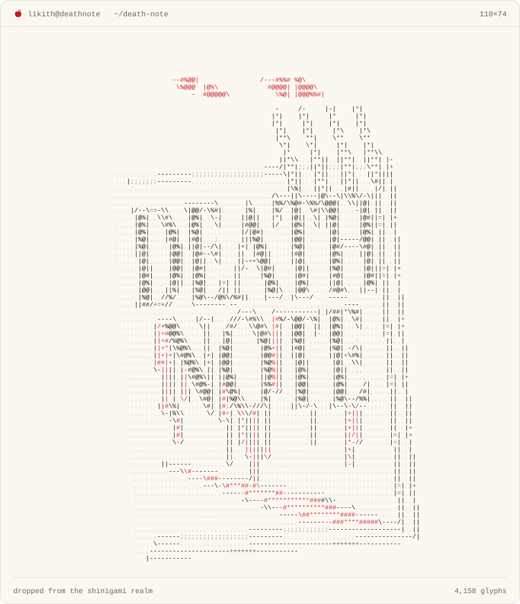
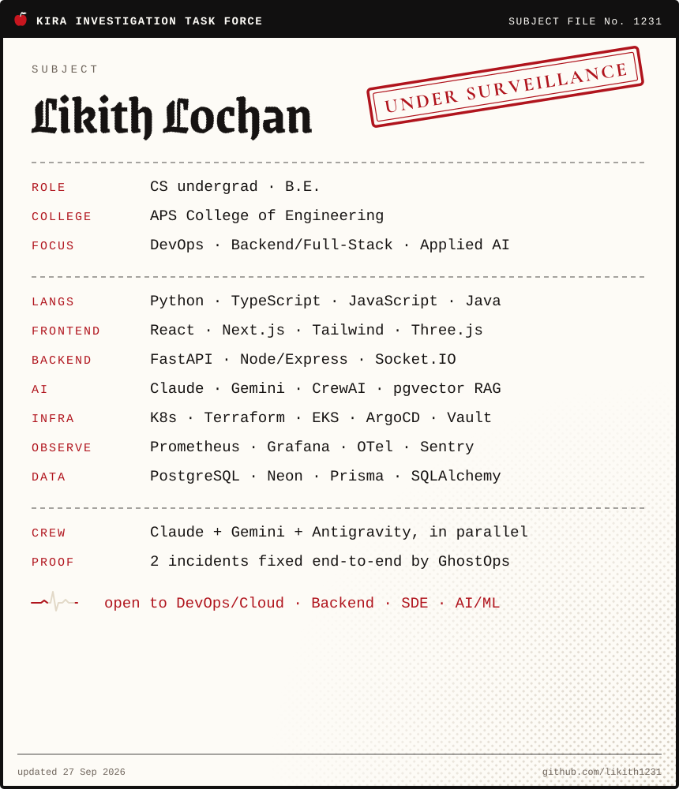
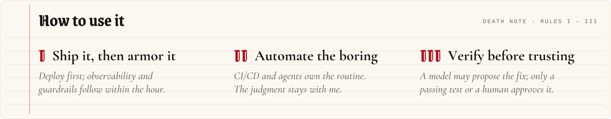

<!-- Generated by scripts/build.py from scripts/content.py. Edit those, not this file. -->

  

<picture><source media="(prefers-color-scheme: dark)" srcset="./assets/header-whoami-dark.svg"></picture>

<picture><source media="(prefers-color-scheme: dark)" srcset="./assets/note-dark.svg"></picture> <picture><source media="(prefers-color-scheme: dark)" srcset="./assets/whoami-dark.svg"></picture>

  

<picture><source media="(prefers-color-scheme: dark)" srcset="./assets/header-rules-dark.svg"></picture>

<picture><source media="(prefers-color-scheme: dark)" srcset="./assets/rules-dark.svg"></picture>

  

<picture><source media="(prefers-color-scheme: dark)" srcset="./assets/header-activity-dark.svg"></picture>

<picture>
  <source media="(prefers-color-scheme: dark)" srcset="https://raw.githubusercontent.com/likith1231/likith1231/output/github-snake-dark.svg" />
  <source media="(prefers-color-scheme: light)" srcset="https://raw.githubusercontent.com/likith1231/likith1231/output/github-snake.svg" />
  
</picture>

  

<picture><source media="(prefers-color-scheme: dark)" srcset="./assets/header-contact-dark.svg"></picture>

<a href="https://www.linkedin.com/in/likith-lochan-2ab93b290"><picture><source media="(prefers-color-scheme: dark)" srcset="./assets/link-linkedin-dark.svg"></picture></a> <a href="mailto:likithlu3@gmail.com"><picture><source media="(prefers-color-scheme: dark)" srcset="./assets/link-email-dark.svg"></picture></a> <a href="https://github.com/likith1231?tab=repositories"><picture><source media="(prefers-color-scheme: dark)" srcset="./assets/link-github-dark.svg"></picture></a>

