<!-- Generated by scripts/build.py. Edit the scripts, not this file. -->

<a href="https://portfolio-zeta-navy-fylz2ik8js.vercel.app/"><picture><source media="(prefers-color-scheme: dark)" srcset="./assets/dark/banner.svg">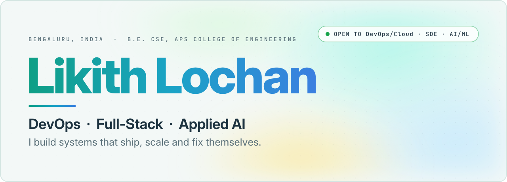</picture></a>

<picture><source media="(prefers-color-scheme: dark)" srcset="./assets/dark/ep-01.svg"></picture>

<picture><source media="(prefers-color-scheme: dark)" srcset="./assets/dark/stats.svg">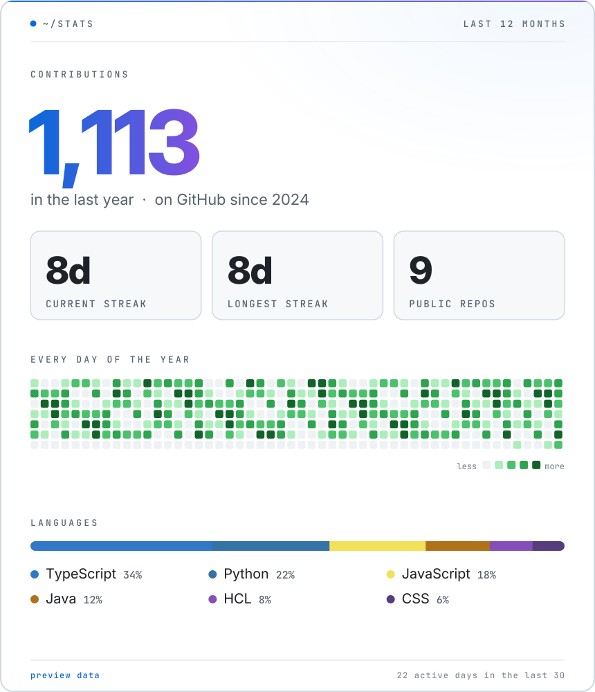</picture> <picture><source media="(prefers-color-scheme: dark)" srcset="./assets/dark/whoami.svg">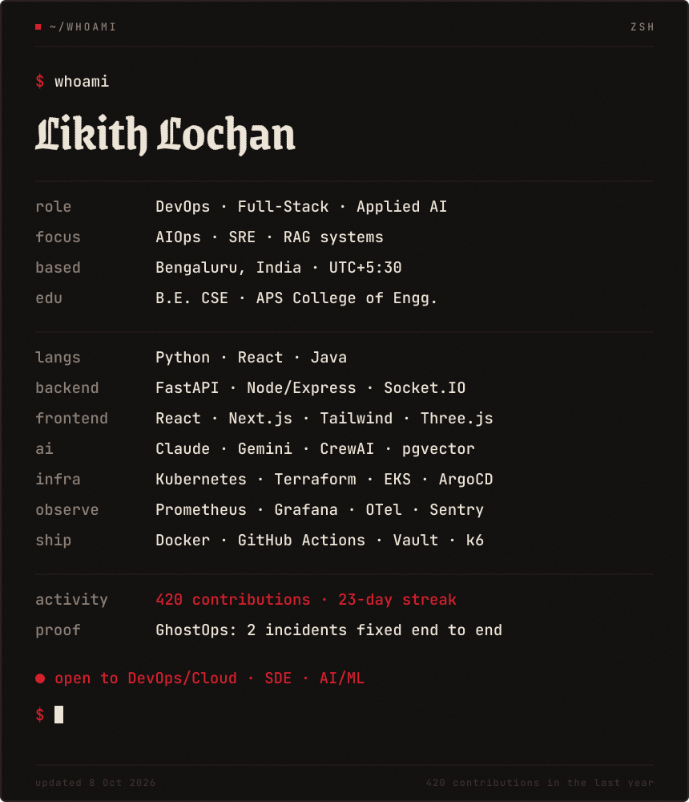</picture>

<picture><source media="(prefers-color-scheme: dark)" srcset="./assets/dark/ep-02.svg">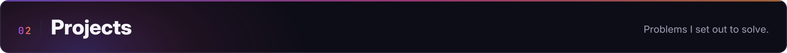</picture>

<a href="https://github.com/likith1231/ghostops"><picture><source media="(prefers-color-scheme: dark)" srcset="./assets/dark/entry-1.svg">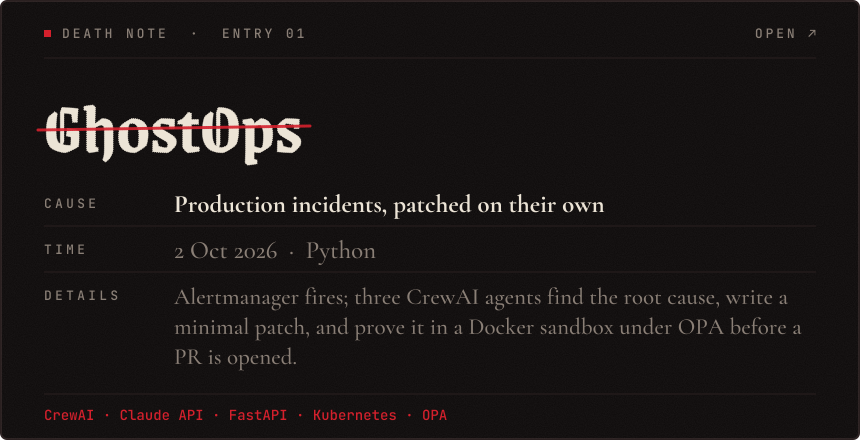</picture></a> <a href="https://github.com/likith1231/Aethermed"><picture><source media="(prefers-color-scheme: dark)" srcset="./assets/dark/entry-2.svg">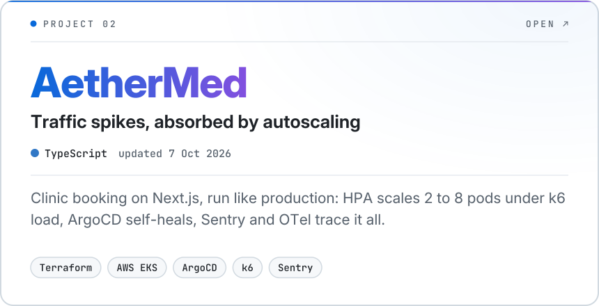</picture></a>

<a href="https://github.com/likith1231/sahayak"><picture><source media="(prefers-color-scheme: dark)" srcset="./assets/dark/entry-3.svg">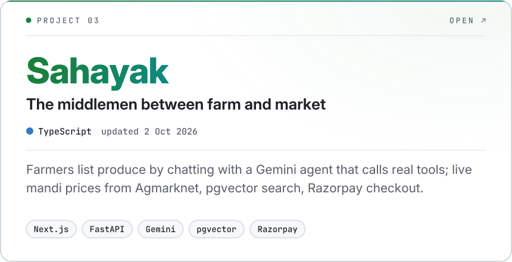</picture></a> <a href="https://github.com/likith1231/greencart"><picture><source media="(prefers-color-scheme: dark)" srcset="./assets/dark/entry-4.svg">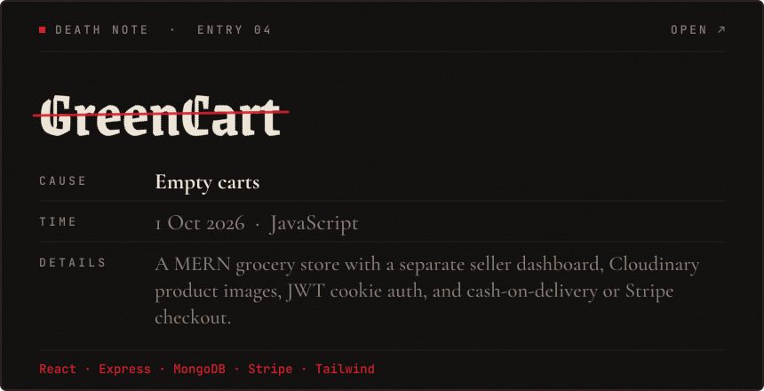</picture></a>

<a href="https://github.com/likith1231/Orbit-IDE"><picture><source media="(prefers-color-scheme: dark)" srcset="./assets/dark/entry-5.svg">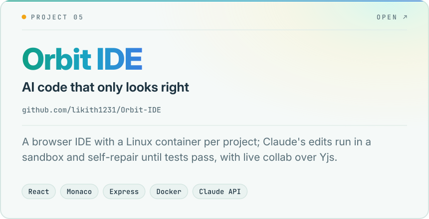</picture></a> <a href="https://github.com/likith1231/Project-Management"><picture><source media="(prefers-color-scheme: dark)" srcset="./assets/dark/entry-6.svg">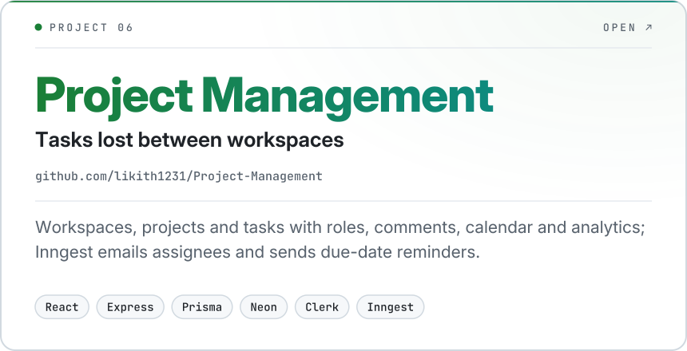</picture></a>

<picture><source media="(prefers-color-scheme: dark)" srcset="./assets/dark/ep-03.svg">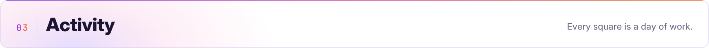</picture>

<picture><source media="(prefers-color-scheme: dark)" srcset="https://raw.githubusercontent.com/likith1231/likith1231/output/github-snake-dark.svg"></picture>

<picture><source media="(prefers-color-scheme: dark)" srcset="./assets/dark/ep-04.svg">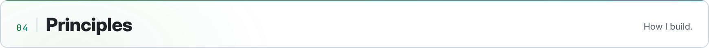</picture>

<picture><source media="(prefers-color-scheme: dark)" srcset="./assets/dark/rules.svg">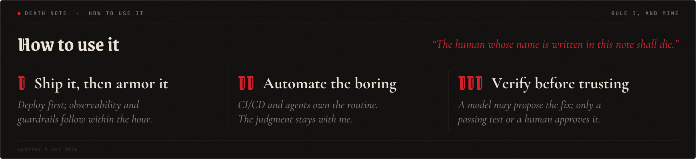</picture>

<picture><source media="(prefers-color-scheme: dark)" srcset="./assets/dark/ep-05.svg">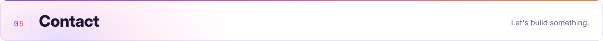</picture>

<a href="https://portfolio-zeta-navy-fylz2ik8js.vercel.app/"><picture><source media="(prefers-color-scheme: dark)" srcset="./assets/dark/link-portfolio.svg"></picture></a> <a href="https://www.linkedin.com/in/likith-lochan-2ab93b290"><picture><source media="(prefers-color-scheme: dark)" srcset="./assets/dark/link-linkedin.svg"></picture></a> <a href="mailto:likithlu3@gmail.com"><picture><source media="(prefers-color-scheme: dark)" srcset="./assets/dark/link-email.svg"></picture></a> <a href="https://github.com/likith1231?tab=repositories"><picture><source media="(prefers-color-scheme: dark)" srcset="./assets/dark/link-github.svg"></picture></a>

