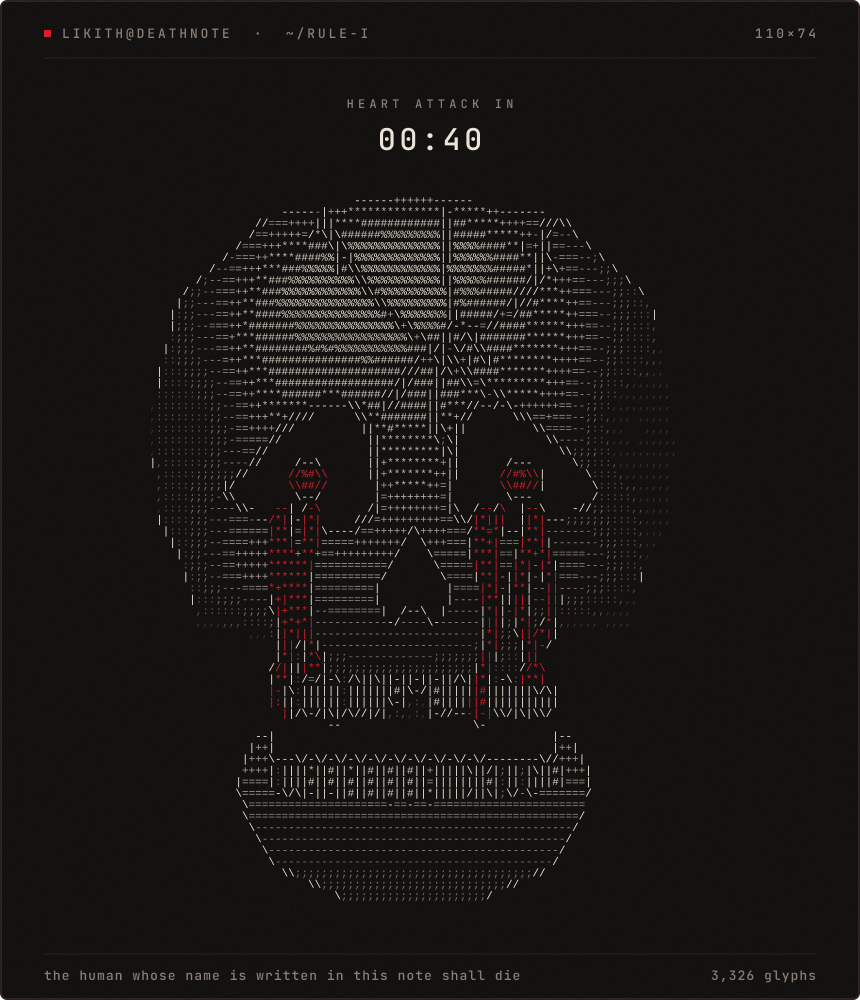

<!-- Generated by scripts/build.py. Edit the scripts, not this file. -->

 

 

 

<picture><source media="(prefers-color-scheme: dark)" srcset="https://raw.githubusercontent.com/likith1231/likith1231/output/github-snake-dark.svg"></picture>

  

